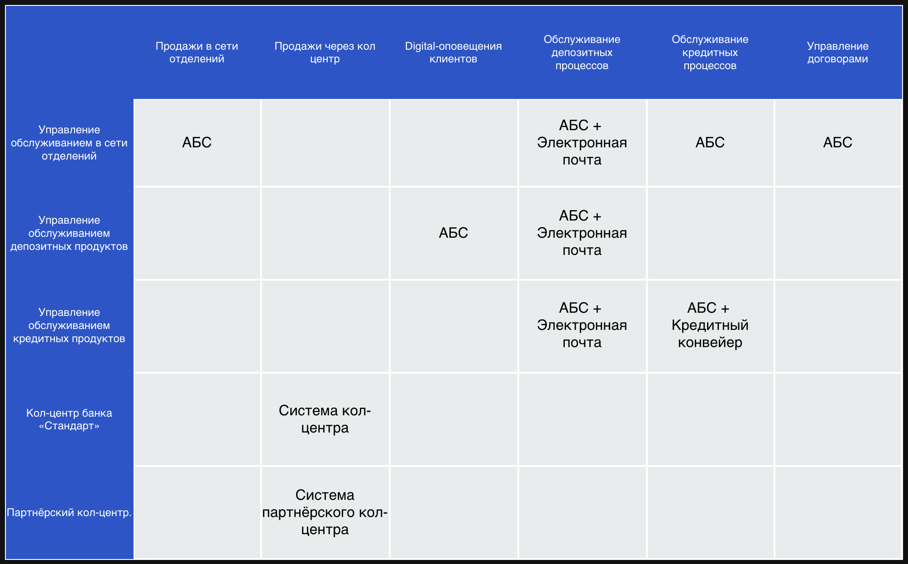
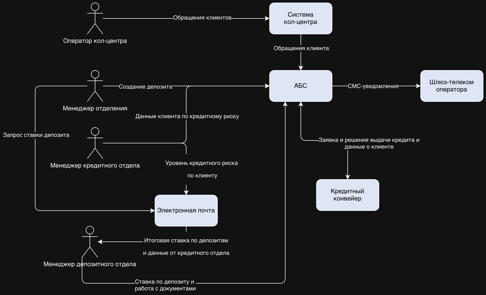
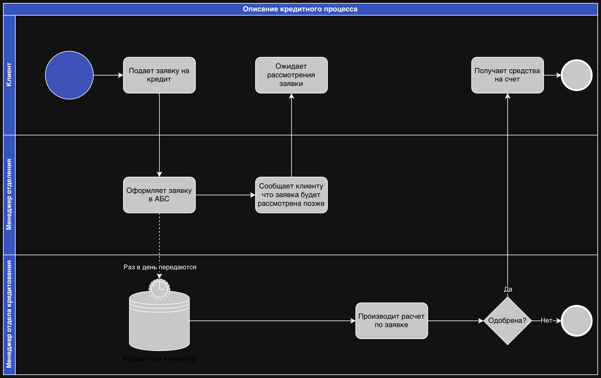

# Проектная работа 3: Цифровая трансформация банка "Стандарт"

# Решения задач

## Задание 1. Карта IT-ландшафта и схема интеграции приложений

Cоздайте в [draw.io](http://draw.io):
1. **Карту текущего IT-ландшафта.** В строках она должна содержать элементы организационной структуры, а в колонках — бизнес-возможности второго уровня. Например, в строке стоит кол-центр, а в колонке — продажи через кол-центр.
2. **Схему интеграции приложений с указанием участников процессов.**

Дополните карту ландшафта и схему интеграции описанием кредитного процесса.

Когда всё будет готово, загрузите артефакты в директорию Task1 в рамках пул-реквеста.

Карта текущего IT-ландшафта

Cхема интеграции приложений с указанием участников процессов

Описание кредитного процесса
