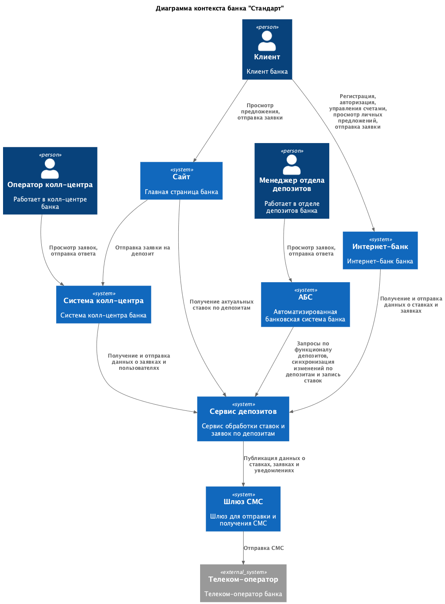
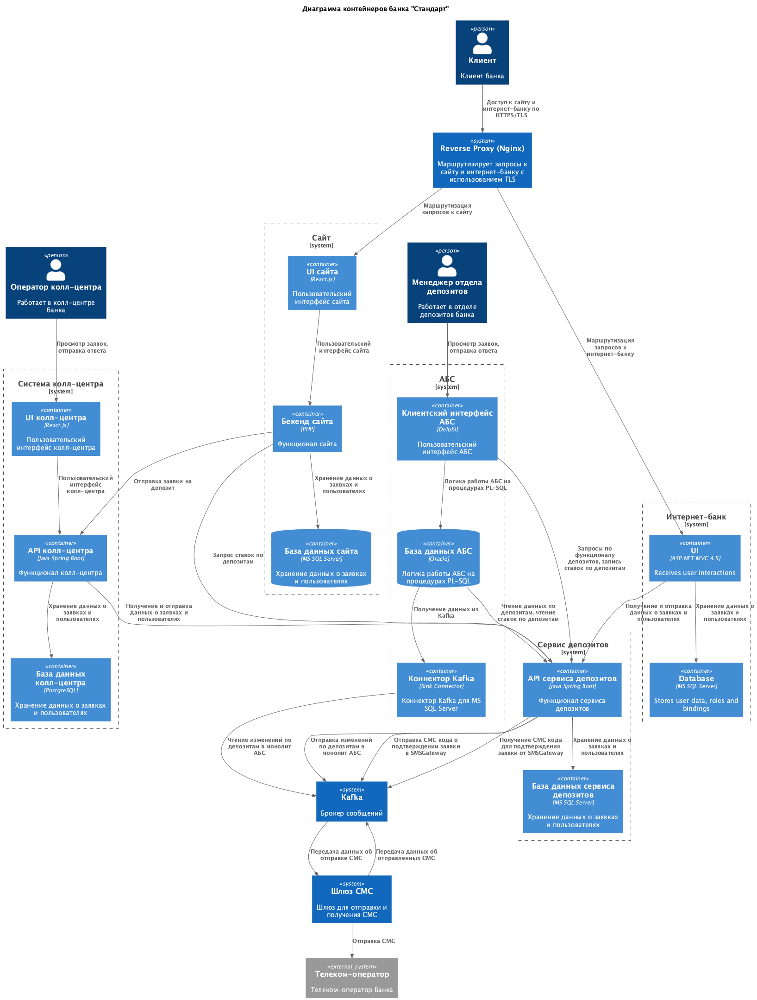

### Название задачи: Открытие депозитов онлайн

### Автор: -

### Дата: 03.04.2026

### Функциональные требования

Опишите здесь верхнеуровневые Use Cases. Их нужно оформить в виде таблицы с пошаговым описанием:

| №   | Действующие лица или системы | Use Case                                            | Описание                                                                                                                                                                                                                                                                                                                                                                                                                                                                                                                |
| --- | ---------------------------- | --------------------------------------------------- | ----------------------------------------------------------------------------------------------------------------------------------------------------------------------------------------------------------------------------------------------------------------------------------------------------------------------------------------------------------------------------------------------------------------------------------------------------------------------------------------------------------------------- |
| UC1 | Потенциальный клиент         | Просмотр ставок депозитов на сайте                  | 1. Потенциальный клиент заходит на сайт 2. Сайт отображает в разделе депозитов актуальные ставки по депозитам в банке                                                                                                                                                                                                                                                                                                                                                                                                   |
| UC2 | Клиент банка                 | Просмотре ставок депозитов в интернет-банке         | 1. Клиент банка авторизуется в интернет-банке 2. Интернет-банк отображает список доступных депозитов с актуальными ставками и персонализированные ставки лично для клиента                                                                                                                                                                                                                                                                                                                                              |
| UC3 | Потенциальный клиент         | Подача заявки открытие депозита на сайте            | 1. Потенциальный клиент заходит на сайт 2. Сайт отображает форму для подачи заявки на депозит в разделе депозитов 3. Потенциальный клиент заполняет номер телефона и ФИО 4. Система отправляет запрос в систему кол-центра 5. Пользователю показывается уведомление, что заявка успешно создана 6. После заявки с сайта клиенту звонит кол-центр, а дальнейшее оформление депозита для нового клиента происходит в отделении после идентификации.                                                                       |
| UC4 | Клиент банка                 | Подача заявки на открытие депозита в интернет банке | 1. Пользователь авторизуется в интернет-банке 2. Интернет-банк в разделе депозитов отображает форму подачи заявки на депозит 3. Клиент выбирает счет и сумму депозита 4. Система обрабатывает запрос и посылает СМС на номер клиента 5. Пользователю показывается уведомление, что нужно подтвержить заявку СМС кодом и показывает форму для ввода код 6. Клиент вводит СМС код в форму 7. Система подтверждает заявку 8. Пользователю показывается уведомление, что заявка успешно создана                             |
| UC5 | Менеджер отдела депозитов    | Обработка заявки на открытие депозита               | 1. Менеджер открывает в АБС список новых заявок на депозит 2. Система отображает необработанные заявки на открытие депозита 3. Менеджер открывает заявку 4. Система отображает данные по заявке - данные клиента, параметры заявки и особые условия, если были согласованы кол-центром 5. Менеджер проверяет заявку и подтверждает ставку по депозиту 6. Система переводит заявку в статус обработанной и создает депозит 7. Система отправляет СМС-уведомление пользователю о подтверждении ставки и открытии депозита |
| UC6 | Менеджер отдела депозитов    | Занесение ставок по депозитам в системе АБС         | 1. Менеджер отдела депозитов получает актуальные данные для расчета ставок по почте 2. Менеджер открывает в АБС раздел управления ставками по депозитам 3. Система отображает действующие ставки и доступные для изменения параметры 4. Менеджер вносит новые или обновляет существующие ставки по депозитам 5. Система сохраняет ставки и делает их доступными для использования в интернет-банке и на сайте |
| UC7 | Менеджер кол-центра          | Обработка заявки на депозит в системе кол-центра    | 1. Менеджер открывает в системе кол-центра новые заявки на депозит с сайта 2. Система отображает данные клиента и параметры обращения 3. Менеджер связывается с клиентом и консультирует его по условиям депозита. 4. При необходимости оператор фиксирует особые условия по заявке. 5. Система кол-центра передает результат обработки и согласованные условия в АБС                                                                                                                                                   |

### Нефункциональные требования

Опишите здесь нефункциональные требования и архитектурно значимые требования.

| №   | Требование                                                                                                                                                                                                                                          |
| --- | --------------------------------------------------------------------------------------------------------------------------------------------------------------------------------------------------------------------------------------------------- |
| 1   | Все сервисы, в т.ч. интернет-банк, должны работать 24/7 и быть доступны в 99,9% случаев                                                                                                                                                             |
| 2   | В случае сбоев в ЦОД необходимо, чтобы сервисы интернет-банка были доступны и выдерживали требуемую нагрузку.                                                                                                                                       |
| 3   | Отклик по всем операциям должен быть менее 1 с.                                                                                                                                                                                                     |
| 4   | Вместо доработок функционала работы с СМС, который сейчас в ядре системы, силами подрядчика необходимо реализовать их своими силами для исключения зависимости от сторонней команды.                                                                |
| 5   | Функционал ведения и согласования ставок по депозитам и заявкам необходимо реализовать в АБС.                                                                                                                                                       |
| 6   | В интернет-банке и сайте данные при передаче нужно защищать механизмом шифрования трафика.                                                                                                                                                          |
| 7   | При доработках во всех системах приоритет отдается технологиям, которые уже есть в банке, либо с теми, где уже есть экспертиза у сотрудников банка. При выборе новых технологий, они должны быть совместимы с существующими платформами разработки. |
| 8   | При потребности в очередях сообщений требуется использовать Kafka и перевести функционал открытия депозитов на микросервисную архитектуру. на перспективу.                                                                                          |
| 9   | При проектировании нужно избегать прямой работы интернет-банка с API АБС в новом процессе                                                                                                                                                           |
| 10  |                                                                                                                                                                                                                                                     |
| 11  |                                                                                                                                                                                                                                                     |

### Решение

> Приведите диаграммы контекста и контейнеров в модели C4. > Опишите там основные компоненты и интеграции всех элементов решения.  

Диаграмма контекста  
  
Диаграмма контейнеров  
  

В системе АБС есть проблема с горизонтальным масштабированием, поэтому желательно весь новый функционал реализовывать в микросервисах, поэтому было решено вынести работу с депозитами в Сервис депозитов.

Для поддержки текущего функционала предусмотрена асинхронная синхронизация данных с нового сервиса на старый бекенд АБС через Kafka, а все вызовы на изменение данных проводить на новом сервисе. 

При необходимости получения новых данных по депозитам предусмотрен прямой вызов API сервиса депозитов из системы АБС.

Работа с СМС также реализована через Kafka для избежания зависимости от стабильности и производительности шлюза СМС.

Также для обработки ставок по депозитам на сайте предполагается раз в день заносить эти ставки через систему АБС менеджером бек-офиса. Это сделано как временное решение для MVP, поскольку оно не несет цели показать всю целевую архитектуру IT-систем банка. 
В будущем можно реализовать интеграцию с Центробанков и кредитным конвейером для автоматического расчета ставки по депозитам и ее смены в системе после подтверждения ответственного лица.

Сайт и интернет-банк публикуются только через защищенный веб-контур банка. TLS завершается на внешнем reverse proxy / балансировщике нагрузки в периметре банка

### Альтернативы

> Опишите здесь наиболее важные альтернативные решения. Недостатки, ограничения, риски
> Подробно опишите здесь недостатки, ограничения и риски выбранного решения.

Альтернативное решение: Реализовать открытие депозитов в АБС
Плюсы: Простота реализации
Минусы: Проблемы с горизонтальным масштабированием

