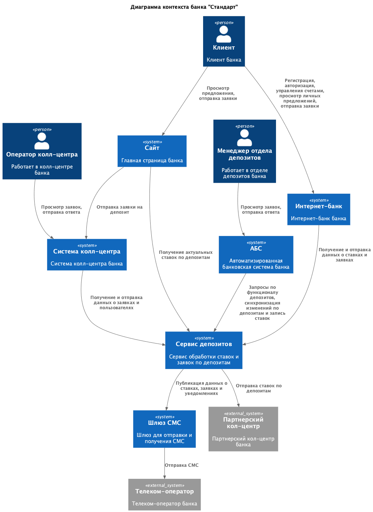
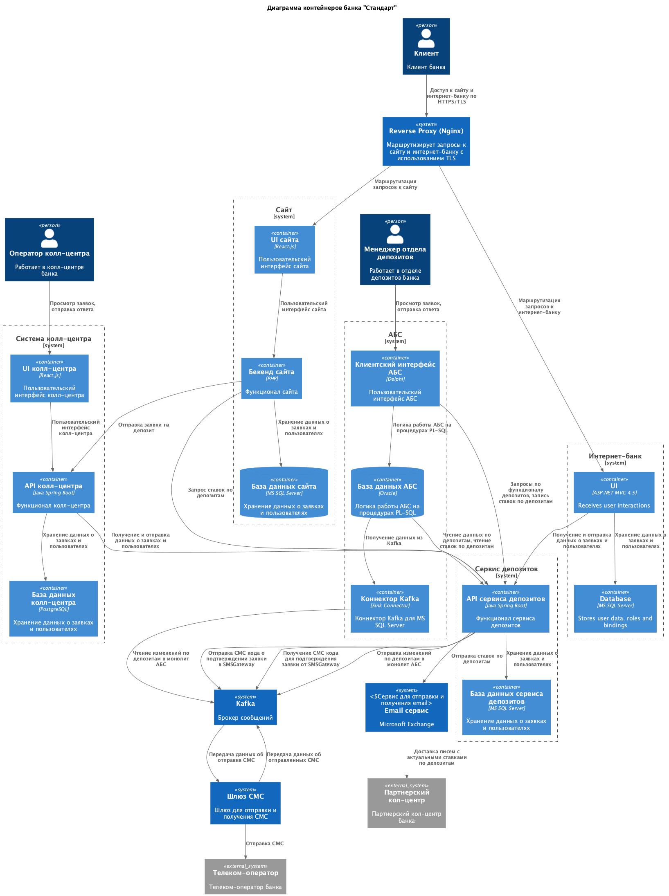
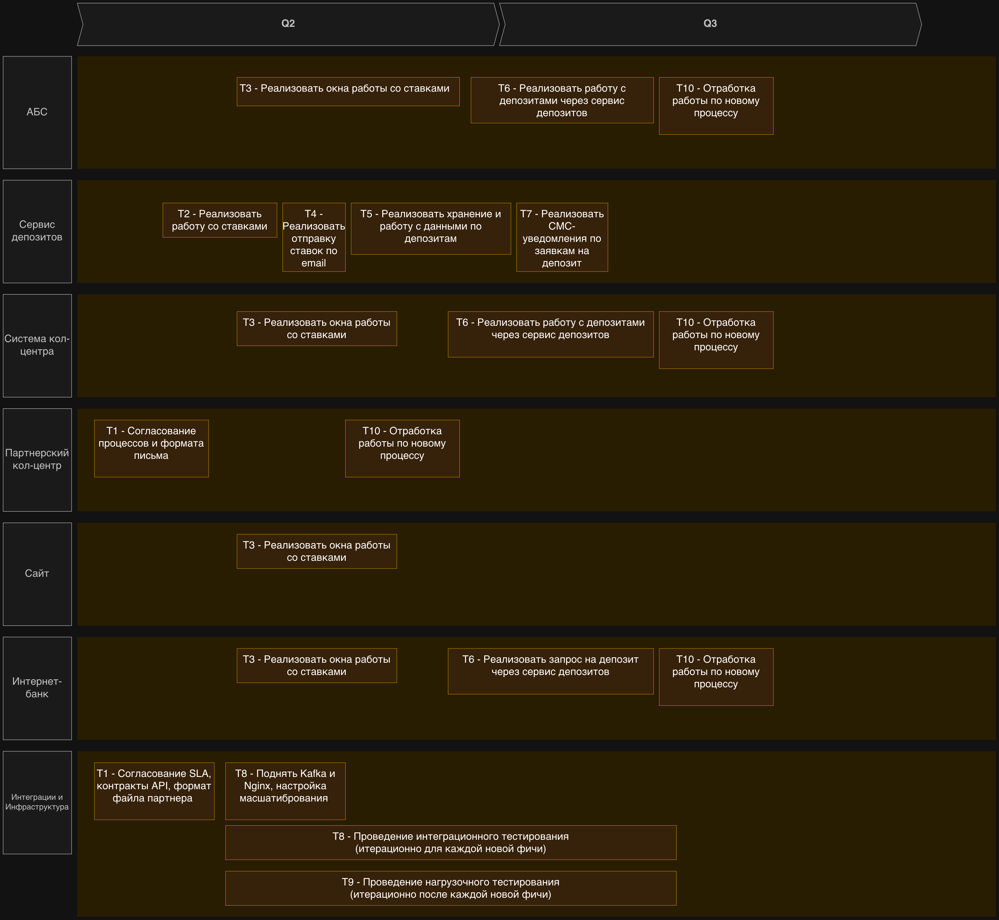

### Название задачи: Передача ставок в кол-центр

### Автор: -

### Дата: 04.05.2026

### Функциональные требования

Опишите здесь верхнеуровневые Use Cases. Их нужно оформить в виде таблицы с пошаговым описанием:

| **№** | **Действующие лица или системы** | **Use Case**                                | **Описание**                                                                                                                                                                                                                                                                                                                                                                                                                                                                                                                                                                        |
| ----- | -------------------------------- | ------------------------------------------- | ----------------------------------------------------------------------------------------------------------------------------------------------------------------------------------------------------------------------------------------------------------------------------------------------------------------------------------------------------------------------------------------------------------------------------------------------------------------------------------------------------------------------------------------------------------------------------------- |
| UC1   | Менеджер отдела депозитов        | Занесение ставок по депозитам в системе АБС | 1. Менеджер отдела депозитов получает актуальные данные для расчета ставок по почте 2. Менеджер открывает в АБС раздел управления ставками по депозитам 3. Система отображает действующие ставки и доступные для изменения параметры 4. Менеджер вносит новые или обновляет существующие ставки по депозитам 5. Система сохраняет ставки и делает их доступными для использования в интернет-банке и на сайте 6. Система формирует письмо и отправляет данные по почте партнерскому кол-центру 7. При неудачной отправке показывается уведомление с возможностью повторной отправки |
| UC2   | Сотрудник внутреннего кол-центра | Получение актуальных ставок по депозитам    | 1. Сотрудник кол-центра открывает систему кол-центра и переходит во вкладку депозитов 2. Система отображает список ставок, их детали и дату действия                                                                                                                                                                                                                                                                                                                                                                                                                                |
| UC3   | Сотрудник внешнего кол-центра    | Получение актуальных ставок по депозитам    | 1. Сотрудник кол-центра получает письмо на почтовый ящик с актуальными ставками и датой действия 2. Сотрудник кол-центра распространяет информацию между другими сотрудникам кол-центра                                                                                                                                                                                                                                                                                                                                                                                             |

### Нефункциональные требования

Опишите здесь нефункциональные требования и архитектурно значимые требования.

| **№** | **Требование**                                                                                                                                                                                                                                      |
| ----- | --------------------------------------------------------------------------------------------------------------------------------------------------------------------------------------------------------------------------------------------------- |
| 1     | Нет возможности сделать API-вызовы (например, через SFTP-протокол) между банком и внешним кол-центром.                                                                                                                                              |
| 2     | Все сервисы, в т.ч. интернет-банк, должны работать 24/7 и быть доступны в 99,9% случаев                                                                                                                                                             |
| 3     | В случае сбоев в ЦОД необходимо, чтобы сервисы интернет-банка были доступны и выдерживали требуемую нагрузку.                                                                                                                                       |
| 4     | Отклик по всем операциям должен быть менее 1 с.                                                                                                                                                                                                     |
| 5     | В интернет-банке и сайте данные при передаче нужно защищать механизмом шифрования трафика.                                                                                                                                                          |
| 6     | При доработках во всех системах приоритет отдается технологиям, которые уже есть в банке, либо с теми, где уже есть экспертиза у сотрудников банка. При выборе новых технологий, они должны быть совместимы с существующими платформами разработки. |
| 7     | При потребности в очередях сообщений требуется использовать Kafka и перевести функционал открытия депозитов на микросервисную архитектуру. на перспективу.                                                                                          |
| 8     | При проектировании нужно избегать прямой работы интернет-банка с API АБС в новом процессе                                                                                                                                                           |

### Решение

> Приведите диаграммы контекста и контейнеров в модели C4. Опишите там основные компоненты и интеграции всех элементов решения.
> Также опишите, какой логикой вы руководствовались в ходе принятия решений и выбора технологий. Не забывайте, что необходимо учесть все функциональные и нефункциональные требования.

Из-за ограничений, когда нельзя делать вызовы напрямую из партнерского кол-центра(даже SFTP протокол нельзя использовать), то варианты решения снижаются

Варианты решения

1. Отправка через email
2. Веб-кабинет для сотрудников внешнего кол-центра
3. Вручную загружать на общий сетевой диск

Наиболее удобным вариантом решения видится отправка через email, поскольку его можно автоматизировать.

После загрузки ставок через UI системы АБС в Сервис депозитов, сервис депозитов автоматически формирует письмо с согласованным форматом на заранее оговоренный почтовый ящик(или ящики) партнерского кол-центра.

Это решение позволяет иметь одинаковые данные в обоих системах и исключает человеческий фактор.

Диаграмма контекста

Диаграмма контейнеров

### Альтернативы

> Опишите здесь наиболее важные альтернативные решения.
> Недостатки, ограничения, риски
> Подробно опишите здесь недостатки, ограничения и риски выбранного решения.

Решение: Веб-кабинет для сотрудников внешнего кол-центра
Плюсы: Не требует отправки данных, можно регулировать доступ к данным у партнерского кол-центра и расширять функционал
Минусы: Более трудозатратно по сравнению с отправкой по email. Ради одной отправки ставок делать веб-кабинет многовато, а расширение функционала не обязателньо понадобиться.

Решение: Вручную загружать на общий сетевой диск
Плюсы: Не требует написания кода, просто в реализации
Минусы: Не очень вяжется с цифровизацией банка и зависимо от человеческих ошибок.

### Roadmap
