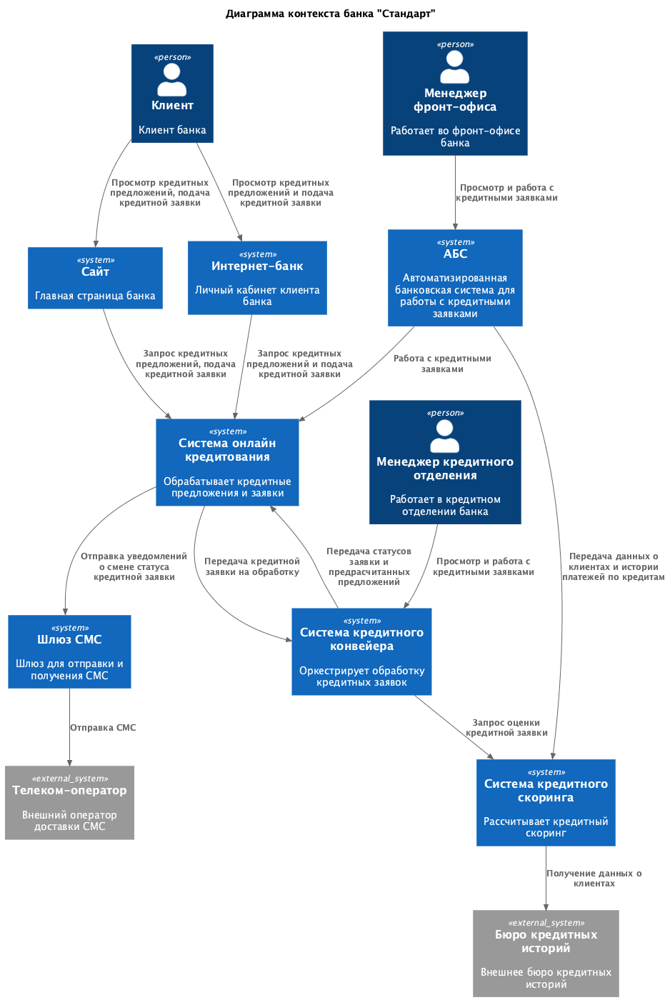
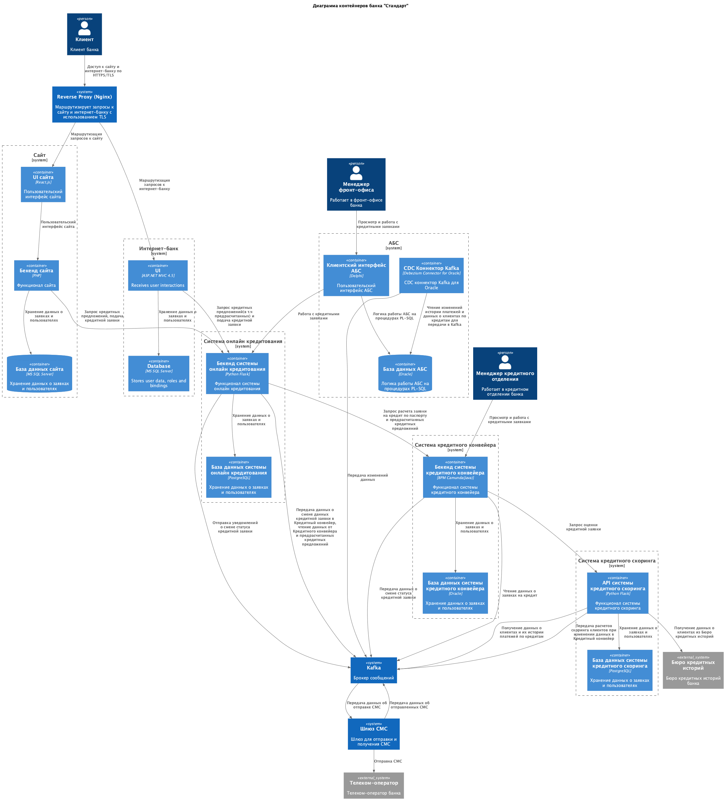

### Название задачи: Заявка на кредит онлайн

### Автор:

### Дата: 04.05.2026

### Функциональные требования

Опишите здесь верхнеуровневые Use Cases. Их нужно оформить в виде таблицы с пошаговым описанием:

| №   | Действующие лица или системы      | Use Case                                                                           | Описание                                                                                                                                                                                                                                                                                                                                                                                                                                                    |
| --- | --------------------------------- | ---------------------------------------------------------------------------------- | ----------------------------------------------------------------------------------------------------------------------------------------------------------------------------------------------------------------------------------------------------------------------------------------------------------------------------------------------------------------------------------------------------------------------------------------------------------- |
| UC1 | Потенциальный клиент              | Просмотр кредитных предложений на сайте                                            | 1. Потенциальный клиент открывает раздел кредитов на сайте. 2. Сайт отображает доступные кредитные продукты и базовые условия. 3. Клиент выбирает подходящее предложение и при необходимости переходит к заполнению заявки.                                                                                                                                                                                                                               |
| UC2 | Потенциальный клиент              | Подача заявки на кредит на сайте без предварительного решения                      | 1. Потенциальный клиент на сайте заполняет ФИО и номер телефона. 2. Система сохраняет заявку на кредит. 3. Клиенту показывается сообщение об успешной отправке заявки.4. Система отправляет СМС-уведомление о регистрации заявки.                                                                                                                                                                                                                  |
| UC3 | Потенциальный клиент              | Подача заявки на кредит на сайте с получением предварительного решения             | 1. Потенциальный клиент заполняет ФИО, номер телефона и паспортные данные. 2. Система сохраняет заявку и инициирует запрос на предварительный скоринг. 3. Система получает данные из бюро кредитных историй и рассчитывает предварительное решение. 4. Клиенту показывается результат: предварительно одобрено или отказано. 5. При предварительном одобрении клиент получает СМС с приглашением прийти в отделение для идентификации и выдачи кредита. |
| UC4 | Клиент банка                      | Просмотр кредитных предложений и предодобренных условий в интернет-банке           | 1. Клиент авторизуется в интернет-банке. 2. Интернет-банк отображает список доступных кредитных продуктов. 3. При наличии система дополнительно показывает предодобренное предложение с персональными условиями.                                                                                                                                                                                                                                          |
| UC5 | Клиент банка                      | Подача заявки на кредит в интернет-банке                                           | 1. Клиент выбирает кредитный продукт или предодобренное предложение. 2. Клиент указывает счет зачисления средств и заполняет данные заявки. 3. Система отправляет СМС-код подтверждения. 4. Клиент вводит полученный код. 5. Интернет-банк подтверждает подачу заявки и передает ее на дальнейшую обработку. 6. Клиенту показывается уведомление, что заявка принята банком.                                                                           |
| UC6 | Менеджер фронт-офиса              | Продолжение работы с ранее созданной онлайн-заявкой в отделении                    | 1. Клиент приходит в отделение банка. 2. Менеджер идентифицирует клиента и ищет его заявку в АБС. 3. Если онлайн-заявка уже существует, менеджер продолжает работать с ней. 4. Если заявки нет, менеджер создает новую заявку. 5. После финального решения менеджер оформляет дальнейшие действия по выдаче кредита.                                                                                                                                    |
| UC7 | Менеджер кредитного подразделения | Обработка стандартной кредитной заявки                                             | 1. Заявка поступает в Кредитный конвейер. 2. Менеджер открывает заявку в Кредитном конвейере. 3. Система запускает скоринг и собирает необходимые данные из внутренних и внешних источников. 4. Менеджер анализирует результат и принимает решение по заявке. 5. Система обновляет статус заявки и отправляет СМС-уведомление клиенту о смене заявки.                                                                                                   |
| UC8 | Менеджер кредитного подразделения | Ускоренная обработка заявки по предодобренному предложению и уведомление о статусе | 1. Менеджер получает заявку, созданную по предодобренному предложению. 2. Менеджер выполняет повторную упрощенную проверку заявки. 3. Менеджер принимает решение по заявке. 4. Система обновляет статус заявки и отправляет СМС-уведомление клиенту о смене заявки.                                                                                                                                                                                      |

### Нефункциональные требования

Опишите здесь нефункциональные требования и архитектурно значимые требования.

| **№** | **Требование**                                                                                                                                                                                                                                      |
| ----- | --------------------------------------------------------------------------------------------------------------------------------------------------------------------------------------------------------------------------------------------------- |
| 1     | Нет возможности сделать API-вызовы (например, через SFTP-протокол) между банком и внешним кол-центром.                                                                                                                                              |
| 2     | Все сервисы, в т.ч. интернет-банк, должны работать 24/7 и быть доступны в 99,9% случаев                                                                                                                                                             |
| 3     | В случае сбоев в ЦОД необходимо, чтобы сервисы интернет-банка были доступны и выдерживали требуемую нагрузку.                                                                                                                                       |
| 4     | Отклик по всем операциям должен быть менее 1 с.                                                                                                                                                                                                     |
| 5     | В интернет-банке и сайте данные при передаче нужно защищать механизмом шифрования трафика.                                                                                                                                                          |
| 6     | При доработках во всех системах приоритет отдается технологиям, которые уже есть в банке, либо с теми, где уже есть экспертиза у сотрудников банка. При выборе новых технологий, они должны быть совместимы с существующими платформами разработки. |
| 7     | При потребности в очередях сообщений требуется использовать Kafka и перевести функционал открытия депозитов на микросервисную архитектуру. на перспективу.                                                                                          |
| 8     | При проектировании нужно избегать прямой работы интернет-банка с API АБС в новом процессе                                                                                                                                                           |
| 9     | Система кредитного скоринга очень важна для работы банка и испытывает повышенную нагрузку в рабочие часы, её не нужно нагружать дополнительными процессами по предрасчетам скорингов.                                                               |
| 10    | Сейчас заявки на кредит попадают в Кредитный конвейер раз в сутки из АБС и этот обмен между базами невозможно ускорить и проводить чаще                                                                                                             |

### Решение

> Приведите диаграммы контекста и контейнеров в модели C4. Опишите там основные компоненты и интеграции всех элементов решения. 
>
> Также опишите, какой логикой вы руководствовались в ходе принятия решений и выбора технологий. Не забывайте, что необходимо учесть все функциональные и нефункциональные требования.

В связи с нефункциональным требованием в запрете прямой связи Интернет-банка с АБС требуется реализовать работу с заявками на кредит в другом месте. Требование к скорости обработки заявки в тот же день при условии, что быстрее чем раз в день передавать данные от АБС к Кредитному конвейеру не представляется возможным, также гласит, что нельзя реализовывать эту логику в системе АБС.

Это может быть отдельный сервис или кредитный конвейер. 
Кредитный конвейер представляется не лучшим вариантом, поскольку станет ответственнен не только за логику одобрения кредитных заявок. 

Решение: Выделить сервис онлайн-кредитования как оркестратор. Кредитный конвейер останется владельцем кредитных заявок и логики ее обработки. Новый сервис отвечает за прием онлайн заявок, интеграцию с банком и сайтом
Плюсы: Не нагружаем Кредитный конвейер новой логикой 

Диаграмма контекста

Диаграмма контейнеров

### Альтернативы

> Опишите здесь наиболее важные альтернативные решения.
>
> Недостатки, ограничения, риски
>
> Подробно опишите здесь недостатки, ограничения и риски выбранного решения.

Решение: Реализовать логику в Кредитном конвейере
Минусы: Станет хранить в себе дополнительную логику и его станет сложнее масштабировать